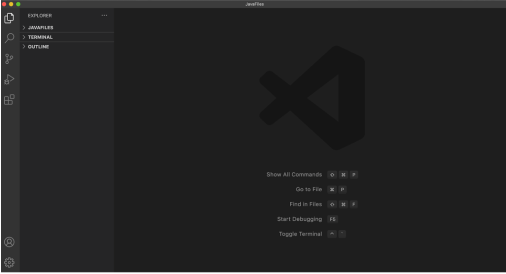

# Lab Report 1 Week 2
## Jackson Loughney

## Step 1: Download Visual Studio Code
* This is the IDE we will be using to program in for all the labs
* There are versions for both PC and MacOS
* Once installed you should see a home page similar to that shown in the image below
* [Click here for the link to download VScode](https://code.visualstudio.com/)


---
## Step 2: Remotely Connecting
* If you are on windows you must download OpenSSH using this [link](https://docs.microsoft.com/en-us/windows-server/administration/openssh/openssh_install_firstuse)
* After this you must look up your course specific account using this [link2](https://sdacs.ucsd.edu/~icc/index.php)
    * This step required you to change your myTriton password before the lab
* **Next you will type the following command:** ```ssh cs15lsp22zz@ieng6.ucsd.edu```
* Once you do this your screen should look like this

---
## Step 3: Trying Some Commands
* This part of the lab is designed to get you comfortable using different commands that deal with ssh and the terminal
* Below are some examples of these commands


```
% cd ~
% cd
% ls -lat
% ls -a
% ls <directory> (which should be: /home/linux/ieng6/cs15lsp22abc)
```


---
## Step 4: Moving Files with scp
* One key step we'll be using this year is copying files back and forth between the computers
* The **scp** command allows us to do this and we run it in our own terminal, not ieng6
* An example of this command would be like this 

---
## Step 5: Setting an SSH Key
* This process allows us to skip the step of entering a passcode when logging into SSH every time
* Below is what you should enter into terminal to complete this step

```
# on client (your computer)

$ ssh-keygen

Generating public/private rsa key pair.

Enter file in which to save the jey
(Users/<user-name>/.ssh/id_rsa): Users/<user-name>/.ssh/id_rsa

Enter passphrase (empty for no passphrase): 

```
---
## Step 6: Optimizing Remote Running (Final Step)
* Using what we learned in the last steps, we can now come up with a more efficent route to
    * make a local edit
    * copying it to the remote server
    * finally running it
* Some commands to help you get inspiration may be as shown below: 
* ```$ ssh cse15lsp22zz@ieng6.ucsd.edu "ls" ```
* ``` $ cp whereAmI.java OtherMain.java; javac OtherMain.java; java WhereAmI ```

