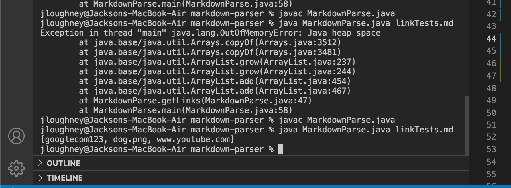

# Lab Report 2 Week 4
## Jackson Loughney
---
---
---
## Code change #1: 

* click the 
[failed file](https://jloughney.github.io/markdown-parser/linkTests.md)
to see the test cases that cause a wrong output because the link is missing a bracket on the end
* below is the error message the fail case gave for the first link in the file

* This bug occurs because without the presence of a close bracket or close parenthesis, the .add method will not run properly. This is because the variable will not be defined, and cannot be used a bound in the add statement.

## Code change #2: 

* click the 
[failed file](https://jloughney.github.io/markdown-parser/linkTests.md)
to see the test cases that cause a wrong output because the second link does not include a ( . ) therefore is not a valid link
* below is the the output that comes without the code change, this is not an error however it gives the wrong output because the correct way would be to not print the links without the proper notation

* This wrong output/bug occurs because without a implementation to check if there is a dot ( . ) in the link, there is no way for it to tell if the link is valid. Once the code change is in place, it will only include links with the proper notation.

## Code change #3: 

* click the 
[failed file](https://jloughney.github.io/markdown-parser/linkTests.md)
to see the test cases that cause a wrong output because the third link shown in the file is not a link but rather an image containing a ( ! ) to indicate this.
* below is the similar output to the last error where we shouldn't see that the image notation in the file is being printed and instead should only output the correctly formatted links
* (dog.png should not part of the correct output)

* this bug/wrong output occurs because the prior implementation does not check for the occurance of a ( ! ) to indicate an image as opposed to a link. In the new code change however, it 

