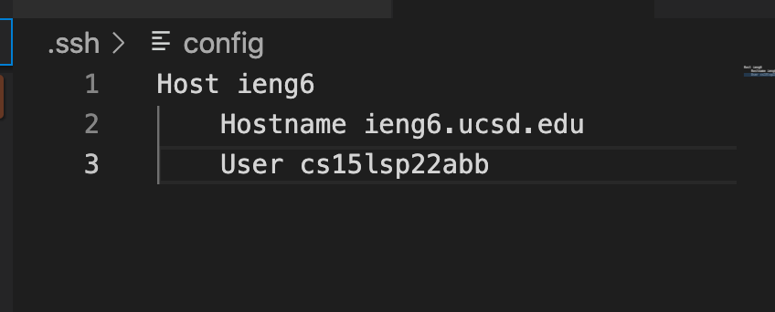
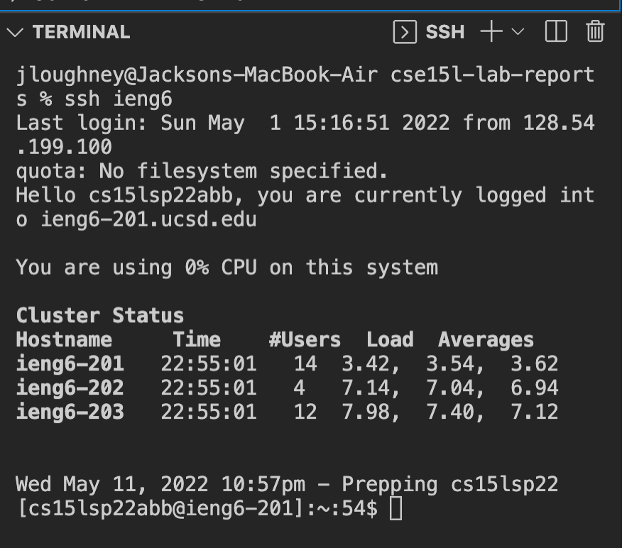
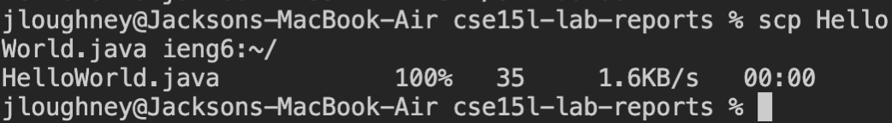
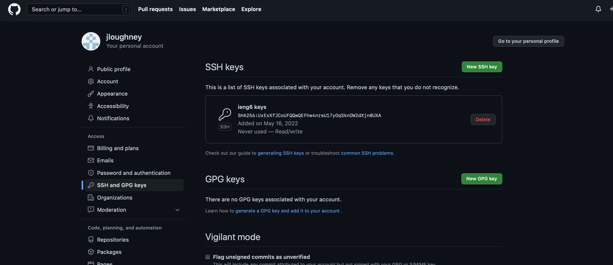
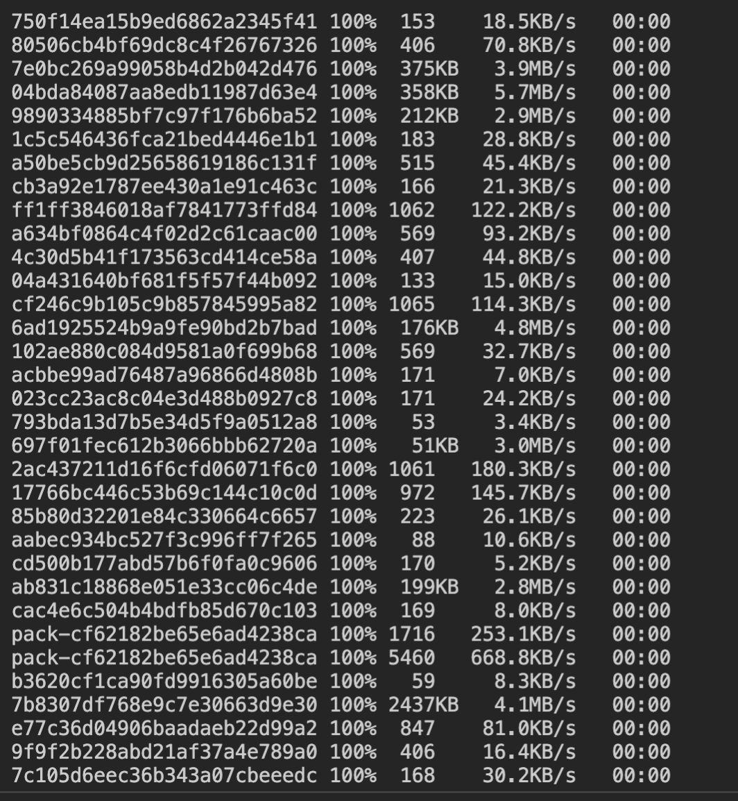
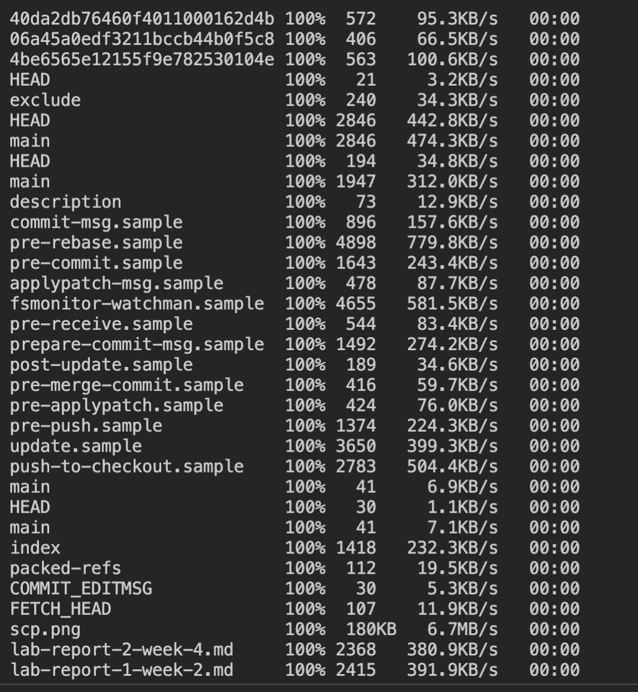
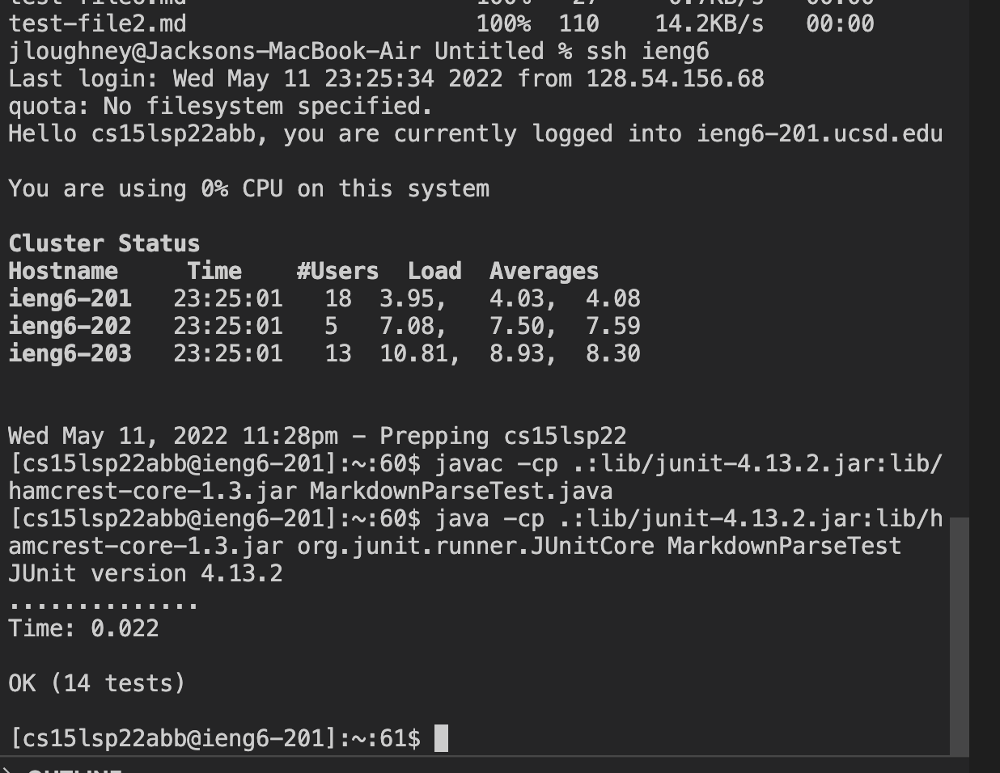
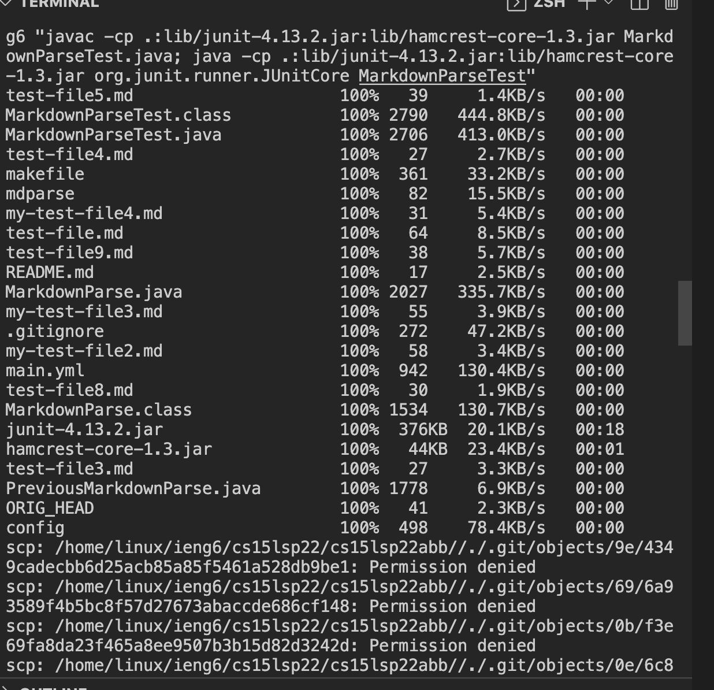
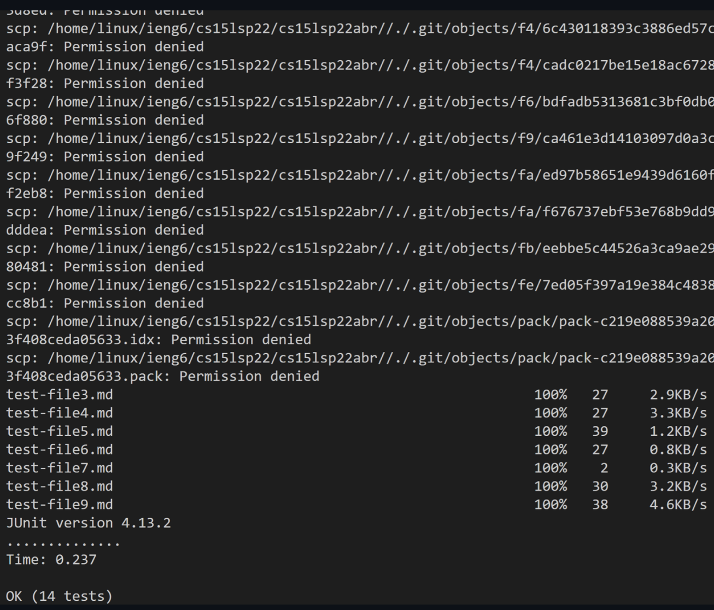

# Lab Report 3 Week 6
## Jackson Loughney
---
---
---
# Streamlining SSH Configuration

- by doing this it allows us to skip the step of typing the full username to log into ssh
- instead you can now simply type **ssh ieng6** and it will fill in the ```cs15lsp22abb``` and ```ieng6.ucsd.edu``` respectively

- once ran in the terminal it will look like this below

- Once using scp to copy a file along with the shortcut we see this


# Setup Github Access from ieng6

- In order to push changes using github to the ssh server we must create a public and private pair of ssh keys
- we create the keys using the commands ```ssh-keygen``` and then ```ssh-add id-rsa``` to create the private key
- then copy the contents of the public key on github settings like the image below



# Copy whole directories with ```scp -r```
- using ```scp -r``` will allow you to copy entire repostiories as oppose to just individually copying the files that way
- an example would be copy the contents of ieng6 into your home repository using the command ```scp -r . ieng6:~/```


- after this is completed you can log into to ssh and run the commands from the previous home repository now in the ssh

- we can run all this in one line executed like this




