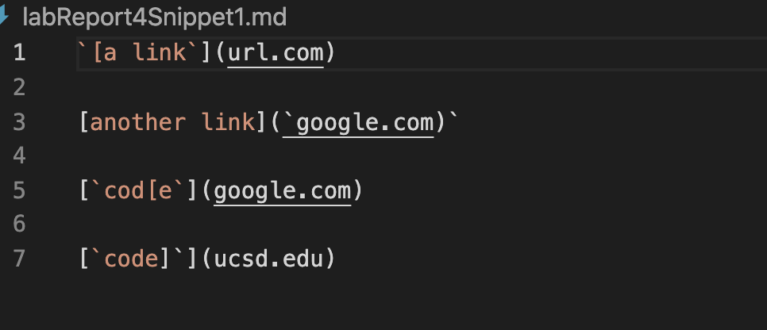
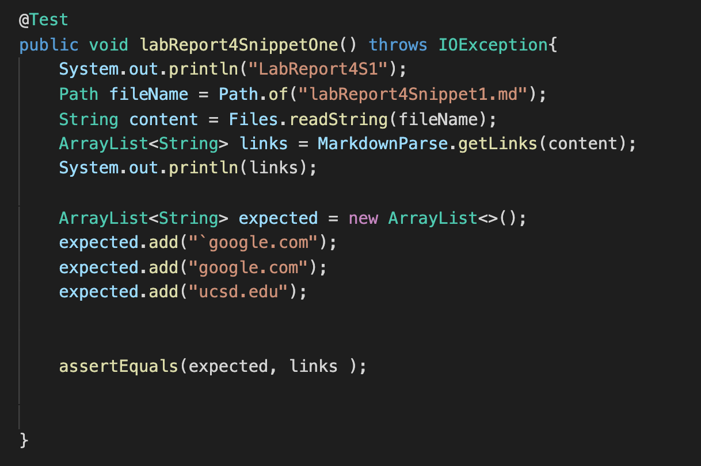
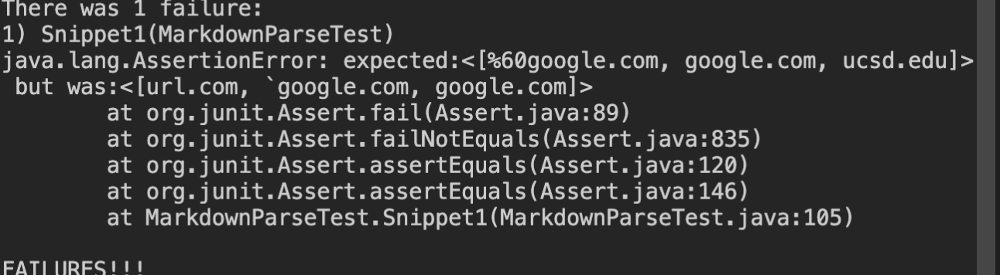
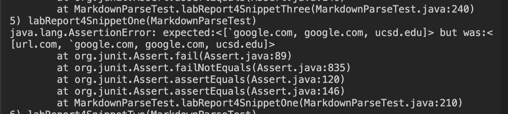
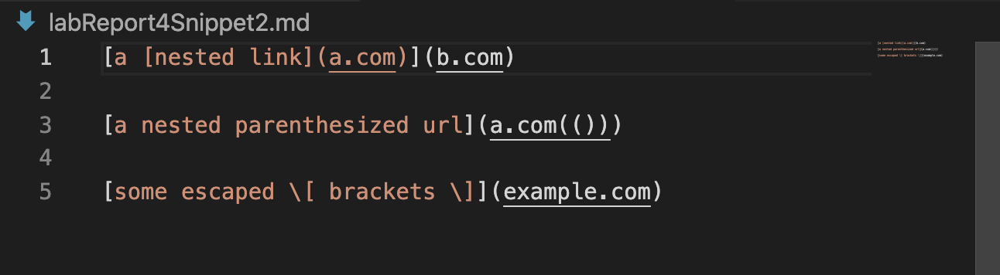
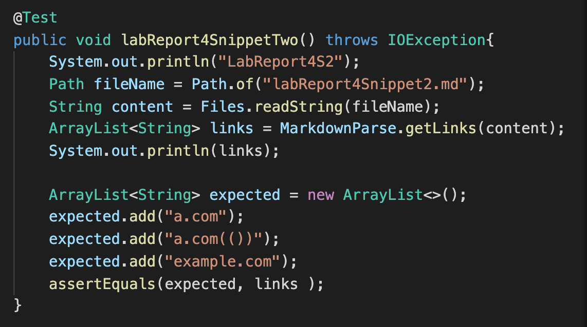
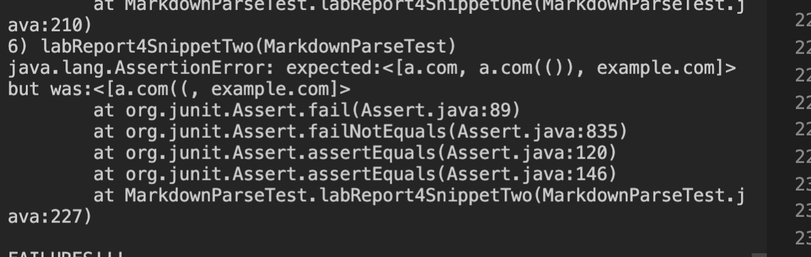
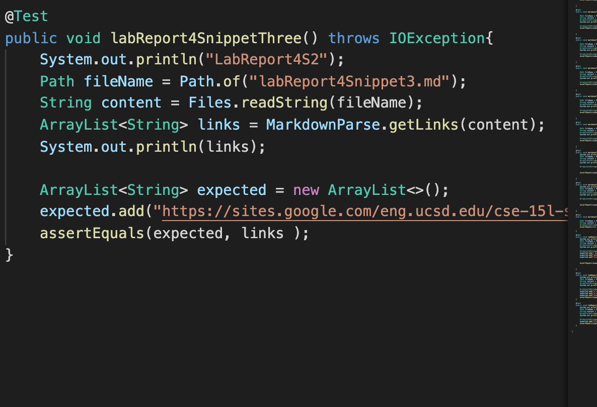
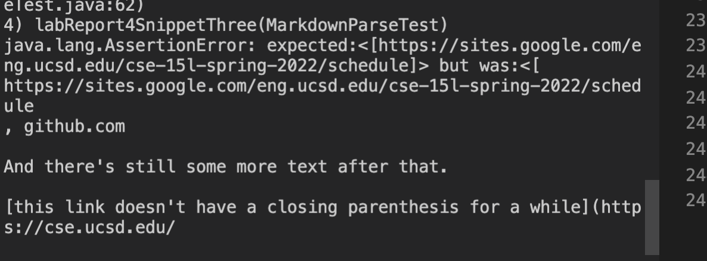

# Lab Report 4 Week 8
## Jackson Loughney
---
---
---
* In this lab report we will be testing markdown parse links on both our groups repository and the group we peer reviewed in lab 7
## Links 
[this](https://github.com/Anujjain2579/markdown-parser) is the link to our groups repository

[this](https://github.com/ddn005UCSD/markdown-parser) is the link to the peer revised repository
## Snippet 1
The first snippet of code looks like this 

The output we expect to get will be ```[`google.com, google.com, ucsd.edu]```. Below is this test to see the correct output:


Here is the result when testing our repository



Here is the result when testing the peer review repository



## Snippet 2
The second snippet of code looks like this 



The output we expect is ```[a.com, a.com(()), example.com]```. Below is the test we used to see the results:



The snippet passed the test on our repository so no failure message was prompted

Here is the result when testing the peer review repository



## Snippet 3
The third snippet of code looks like this 

The third snippet has an expected output of ```[https://sites.google.com/eng.ucsd.edu/cse-15l-spring-2022/schedule]```. Below is the test that we used to see the correct output



The code for our repository passed this test and does not print out an error message.

Here is the result when testing the peer reviewed Repo



## Improvements

* Snippet 1: A relatively small code change will not fix the errors that occur in this snippet. It would take much more because you need to look for backticks to determine areas that are in code format. 
* Snippet 2: A relatively small code change will not fix the errors that occur in this snippet either. The change would take a much more complex fix because it needs to look for new brackets whilst also checking the format for open and closed brackets/parenthesis.
* Snippet 3: There is a easy code change that could be made to help solve this snippet. This change would look at ```indexOf()``` and the open bracket variable. If then the values were in between the two paranthesis then it would increment the loop, the index, and continue.


